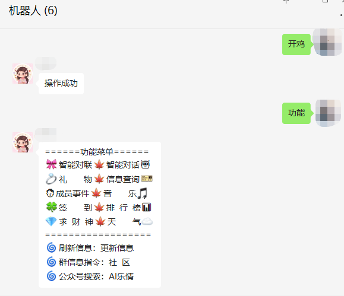

# 可爱猫php群管

#### 介绍
基于可爱猫php群管

#### 启动环境(必须)

1.  语言：作者用的是php8.2.3
2.  redis
3.  mysql
4.  系统：作者用的是win系统
5.  webman框架
6.  composer

#### 使用说明

0. 更新系统：命令行到->phpGroupTube文件夹
```
composer update
```

1. 设置数据库：phpGroupTube文件夹->config文件夹->thinkorm.php文件;数据库文件->phpGroupTube文件夹->keaimao.sql文件
```php
// 服务器地址
'hostname' => '127.0.0.1',
// 数据库名
'database' => 'xxx',
// 数据库用户名
'username' => 'xxx',
// 数据库密码
'password' => 'xxx',
// 数据库连接端口
'hostport' => '3306',
```

2. 设置公网域名或者ip：phpGroupTube文件夹->app文件夹->functions.php文件
```php
define('MineIp', '此处填写你的公网域名或者ip，注意端口是8787，如:127.0.0.1:8787');
```

3. 开启可爱猫:可爱猫.exe文件->启动weixin，然后在可爱猫应用中点击->应用，右键iHttp插件->菜单;
在远程处理接口填:http://127.0.0.1:8787/api/msg/index
调试---必须勾选
然后填写密钥->鉴权密钥:390un88G62u8pzDZtlve97c4T3l7DLYZ
填好之后重启可爱猫程序->启动weixin即可

4. 启动程序:phpGroupTube文件夹->打开windows.bat看见弹出命令行即可

5. 进入后台:你第二步设置的网页地址 http://ip/admin 账号：wechat 密码：wechat

6. (可选-修改后台登录密码):phpGroupTube文件夹->app文件夹->admin文件夹->controller文件夹->LoginController.php文件
```php
$username = "这里填你的新账号";
$pwd = password_hash("这里填你的新密码", PASSWORD_DEFAULT);
```
7. 进入后台:点击群组->设置群开关(开启群聊模式);设置群密码;-----如果看不到数据->点击刷新列表

8. (可选)进入后台:点击好友->设置主人(机器人主人在群内发送：开鸡)即可设置开启群聊



9. 已开源剩下的自己看源码

10. 公众号：AI乐情

### 接口数据
```php
sendMsg(["event" => "GetLoggedAccountList"]); //获取机器人
/* Array
(
    [event] => GetLoggedAccountList
    [code] => 0
    [msg] => successful
    [data] => Array
        (
            [0] => Array
                (
                    [wxid] => wxid_xxx
                    [wx_num] => xxx
                    [nickname] => xxx
                    [headimgurl] => http://wx.qlogo.cn/mmhead/ver_1/xxx/132
                    [headimgbase64] =>
                    [status] => 1
                    [login_time] => 1681442154
                    [wx_wind_handle] => 263068
                    [wx_pid] => 8404
                    [signature] =>
                    [backgroundimgurl] =>
                )
        )
) */
sendMsg(["event" => "GetGroupList", "robot_wxid" => "", "msg" => "1"]); //获取机器人群列
/* Array
(
    [event] => GetGroupList
    [code] => 0
    [msg] => successful
    [data] => Array
        (
            [0] => Array
                (
                    [wxid] => xxx@chatroom
                    [nickname] => xxx
                    [robot_wxid] => wxid_xxx
                    [headimgurl] => http://wx.qlogo.cn/mmcrhead/xxx/0
                    [memberCount] => 127
                    [isManager] => 0
                )

            [1] => Array
                (
                    [wxid] => xxx@chatroom
                    [nickname] => xxx
                    [robot_wxid] => wxid_xxx
                    [headimgurl] =>
                    [memberCount] => 70
                    [isManager] => 0
                )
        )
) */
sendMsg([
    "event" => "GetGroupMemberList",
    "robot_wxid" => "wxid_xxx",
    "group_wxid" => "xxx@chatroom", "msg" => "1"
]); //获取群成员列
/* Array
(
    [event] => GetGroupMemberList
    [code] => 0
    [msg] => successful
    [data] => Array
        (
            [0] => Array
                (
                    [headimgurl] => http://wx.qlogo.cn/mmhead/ver_1/xxx/0
                    [nickname] => xxx
                    [sex] => 2
                    [wx_num] =>
                    [wxid] => wxid_xxx
                    [identity] => 1
                )
            [1] => Array
                (
                    [headimgurl] => http://wx.qlogo.cn/mmhead/ver_1/xxx/0
                    [nickname] => ??起风了
                    [sex] => 0
                    [wx_num] =>
                    [wxid] => xxx
                )
        )
) */
sendMsg([
    "event" => "GetGroupMemberInfo",
    "robot_wxid" => "wxid_xxx", //机器人
    "group_wxid" => "xxx@chatroom", //群号
    "member_wxid" => "xxx", //成员id
    "msg" => "1"
]); //获取群成员详情
/* Array
(
    [event] => GetGroupMemberInfo
    [code] => 0
    [msg] => successful
    [data] => Array
        (
            [backgroundimgurl] => http://szmmsns.qpic.cn/mmsns/xxx/0
            [city] => Shenzhen
            [country] => Shenzhen
            [headimgurl] => http://wx.qlogo.cn/mmhead/ver_1/xxx/0
            [nickname] => ?? 诗与远方
            [note] =>
            [province] => Guangdong
            [scene] => 0
            [sex] => 1
            [signature] => 我已经学会了打架…..
            [v1] =>
            [v2] => xxx@stranger
            [wx_num] =>
            [wxid] => xxx
        )

) */
sendMsg([
    "event" => "GetFriendList",
    "robot_wxid" => "wxid_xxxx", //机器人
    "msg" => "1,0"
]); //获取机器人好友
/* Array
(
    [event] => GetFriendList
    [code] => 0
    [msg] => successful
    [data] => Array
        (
            [0] => Array
                (
                    [headimgurl] => http://wx.qlogo.cn/mmhead/ver_1/xxx/0
                    [nickname] => 123456789
                    [note] =>
                    [sex] => 1
                    [wx_num] => X199801014444
                    [wxid] => wxid_xxx
                    [robot_wxid] => wxid_xxx
                )

            [1] => Array
                (
                    [headimgurl] => http://wx.qlogo.cn/mmhead/ver_1/xxx/0
                    [nickname] => ??嘦焄??
                    [note] =>
                    [sex] => 2
                    [wx_num] =>
                    [wxid] => xxx
                    [robot_wxid] => wxid_xxx
                )
        )
) */
```
